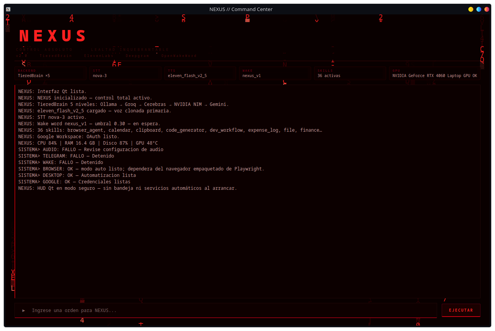

# NEXUS

> **Portfolio showcase** — public documentation of a private project.
> Source code, credentials, and operational details are intentionally excluded.

A local-first, production-grade personal AI system built for real daily use on Linux (Fedora / KDE Plasma). Voice-driven, autonomous, and always running — it manages the machine, not just conversation.

---

## What It Does

NEXUS is used daily as an actual productivity and system-management layer, not a demo. It handles:

- **Voice conversation** with sub-second response (streaming TTS, barge-in interrupt, custom-trained wake word with STT double-verification against false triggers)
- **Natural language routing** — any phrasing in Spanish works; no fixed command syntax required
- **Autonomous desktop control** — opens apps, clicks, types, reads the screen
- **Meeting participation** — joins Meet/Zoom/Teams, transcribes in real time, and can speak inside the meeting through a virtual microphone
- **Meeting representation** — attends a meeting *as* the user: cloned voice, an animated visual identity streamed through a virtual camera, and conversational responses when addressed
- **Meeting-email intelligence** — classifies the real inbox (trained on it), extracts meeting invitations, creates calendar events with context, deduplicates against existing events, and can schedule its own attendance
- **Google Workspace** — sends emails, creates calendar events (with real video-call links) in natural language, reads Drive files
- **Home automation** — controls IoT devices (lights, climate, scripts) by voice
- **TV presence** — speaks announcements through the living-room TV (cast device), plays media on it, controls its volume
- **Personal finance** — summarizes spending from bank notification emails
- **Proactive alerts with judgment** — a dedicated layer deduplicates alerts, respects quiet hours, suppresses non-urgent noise during gaming or focus sessions, and delivers what it held back as a digest afterwards
- **Connection sentinel** — continuously verifies every external provider dependency (LLM, STT, TTS, messaging, OAuth) and alerts only on state changes
- **Web research routing** — informational questions are detected and answered from live web search with synthesis, instead of a stale "I don't know"
- **Passive security monitoring** — watches for unknown high-CPU processes, new open ports, new USB devices, and failed SSH auth attempts; detects only, never acts unilaterally
- **Gated active defense** — can kill a process or isolate the network on request, but only behind explicit confirmation and a protected-process whitelist
- **System resource management** — CPU/RAM priority profiles for work, streaming, or focus sessions
- **Development workflow automation** — runs test suites, reads logs, builds, restarts dev servers
- **Natural-language code generation** — turns a spoken request into a statically validated Python file (generated code is never executed to validate it)
- **Code triage** — diagnoses a pasted error or failed deploy, classifies severity, and briefs a fix — it never applies changes without permission
- **Telegram remote control** — voice-note-first responses from anywhere, served by a dedicated always-on cloud host independent of the desktop
- **Desktop HUD** — a native control center with live backend telemetry and a real-time conversation log, plus an on-screen "speaking" indicator whenever NEXUS talks
- **Daily OS layer** — morning briefing, end-of-day summary, productivity metrics, daily priorities by voice
- **Gaming mode v2** — enters the instant a game launches (signal from a universal launch wrapper, game name resolved from the store manifest — no hardcoded lists), applies per-game profiles (VRAM budget, GPU power limit, persistent shader cache), and restores everything on exit
- **Self-managed long-term memory** — after each session, durable facts are extracted and promoted into a persistent user profile or a searchable archive
- **Guarded system power control** — can lock, suspend, hibernate, shut down, or restart the machine by voice, gated behind an explicit confirmation step

---

## Capability Overview

| Capability | Status |
|---|---|
| Voice conversation (streaming) | Active — first spoken word in ~0.5 s |
| Barge-in interrupt | Active — VAD-based, ~40 ms reaction |
| Custom wake word | Active — purpose-trained detection model + sustained-score requirement + local STT double-verification before waking |
| Cloned voice (primary) + local fallback | Active — low-latency streaming synthesis, automatic local fallback; the phrase cache only ever persists audio from the primary voice, so a temporary fallback never gets "burned in" |
| Natural language routing | Active — any phrasing, 15+ NL categories, voice and Telegram |
| Web research routing | Active — informational questions detected and answered from live multi-engine web search with synthesis |
| Desktop HUD | Active — native control center, live backend telemetry chips, system tray integration; background effects scale down automatically when unfocused |
| Speaking indicator | Active — an animated on-screen presence appears whenever NEXUS is talking, from any of its processes, above fullscreen windows |
| Skills system | Active — 38 auto-discovered skills (media, focus, GPU monitor, notes, weather, resource manager, dev workflow, security monitor, code generator, cast, personal automation…) |
| Skill retrieval | Active — only the top-K relevant skills are surfaced to the LLM per query (semantic + lexical), instead of flooding context with all 38 |
| Autonomous desktop agent | Active — vision + input, up to 25 steps, allowlisted for safety |
| Meeting agent | Active — join + virtual mic + live transcript + summary with action items and a drafted follow-up |
| Meeting representative | Active — attends as the user: cloned voice, animated identity via virtual camera, conversational replies when addressed |
| Meeting-email intelligence | Active — inbox classifier trained on real mail, invitation extraction, calendar events with context, dedup against existing events, scheduled auto-attendance |
| Proactive monitor | Active — calendar, email, system resources, morning briefing |
| Proactivity judgment layer | Active — dedup, quiet hours, gaming/focus suppression, rate limiting; suppressed alerts delivered later as a digest |
| Connection sentinel | Active — health checks across every external provider (LLM tiers, STT, TTS, messaging, OAuth); alerts only on state changes |
| Passive security watcher | Active — process/port/USB/auth anomaly detection, alert-only |
| Gated active defense | Active — kill process / isolate network behind explicit confirmation + protected-process whitelist |
| Resource manager | Active — CPU/RAM priority profiles (work / streaming / focus / normal) |
| Dev workflow automation | Active — test runner detection, log triage, build, server restart |
| Natural-language code generation | Active — spoken request → statically validated Python file; generated code is never executed during validation |
| Code triage | Active — error/deploy diagnosis with severity classification; briefs the fix, never applies it unasked |
| Guarded system power control | Active — lock is immediate; suspend/hibernate/shutdown/restart require explicit confirmation |
| Telegram (voice-first) | Active — replies with voice note + text; fail-closed authorization (an empty allowlist rejects everyone); runs on a dedicated always-on cloud host, independent of the desktop's power state |
| Cloud cost-safety cutoff | Active — usage guardrail on the cloud host warns, then automatically suspends the service before any free-tier limit would turn into a real charge |
| Google Calendar | Active — natural language event creation and query, real video-call links |
| Gmail | Active — send, reply, draft |
| Google Drive | Active — list, read, create |
| Home automation | Active — IoT device and scene control by voice |
| TV presence (cast) | Active — spoken announcements, media playback, and volume on the living-room TV |
| Personal finance summary | Active — bank notification email parsing |
| Multi-tool exposure (MCP server) | Active — exposes core capabilities as tools for external AI clients |
| External tools (MCP client) | Active — consumes external MCP servers declared in config, no per-integration wrappers |
| Session memory | Active — recent context injected automatically |
| Vector memory | Active — semantic recall |
| Episodic memory | Active — causal event log, queryable by day/week |
| Managed long-term memory | Active — durable facts extracted post-session and promoted to a core profile (system prompt) or searchable archive |
| Secret redaction | Active — API keys, tokens, and credentials are scrubbed before anything is persisted to memory |
| Voice-use audit | Active — every use of the cloned voice is logged (when, where, what — redacted) |
| Task tracker | Active — deadlines, priorities, search |
| Daily OS | Active — morning briefing, day close, metrics, priorities by voice |
| Gaming mode v2 | Active — instant launch signal + per-game profiles (VRAM budget, GPU power, shader cache), heuristic detection as fallback |
| Auto-start on login | Active — background service, starts with the desktop session |

---

## Desktop HUD

A single-panel operator console that runs alongside the voice pipeline — void-black background, blood-red accents, an animated red "digital rain" effect behind the panel.



**What it shows:**
- Title, tagline, and a small tag line naming the active stack
- A live backend bar — active LLM tier count, current STT and TTS models, wake word model, number of loaded skills, GPU status — read directly from configuration and hardware at runtime, not hardcoded
- A single full-width log combining a real boot sequence (each line reflects actual configured state, not placeholder text) with the ongoing conversation
- A command input at the bottom

Operational controls (voice round, Telegram start/stop, wake word restart, self-check, settings, bug reports) live in the system tray menu rather than as buttons in the main window — the main panel stays focused on what NEXUS is doing, not on how to operate it. Detailed system resource usage (CPU/RAM/disk/GPU) is queried on demand through voice or Telegram rather than rendered as a permanent gauge.

The HUD is also resource-disciplined: the animated background scales its frame rate down when the window loses focus and pauses when hidden, and status polling intervals are tuned per data source — a profiling pass cut the HUD's idle CPU usage by ~75%. Separately from the HUD window, a small animated presence appears on screen whenever NEXUS is speaking — from any of its processes — positioned above fullscreen windows so it stays visible even during a game.

---

## Skills System

38 capabilities are packaged as self-contained skills, auto-discovered at startup with no manual registration. Each skill declares its own triggers and handles its own execution context.

Examples:

| Skill | What it does |
|---|---|
| Media control | Play, pause, volume, track info — any phrasing works |
| Focus mode | Timed focus sessions with progress tracking |
| System monitor | CPU, RAM, disk, temperature, GPU VRAM |
| Resource manager | Switch CPU/RAM priority profile for work, streaming, or focus |
| Dev workflow | Run tests, check logs, build, restart the active dev server |
| Security monitor | Query open ports, suspicious processes, whitelist management |
| Code generator | Turn a natural-language request into a validated, saved Python file |
| Reminders | Natural language reminders with delivery via voice |
| Notes | Voice-dictated notes, search, listing |
| Weather | Current conditions for any city |

The same skill responds correctly to "súbele a la música", "sube el volumen", "dale más volumen" — all routed without hardcoded strings.

---

## Daily OS Layer

Beyond task execution, NEXUS functions as a daily operating layer:

**Morning briefing** (`día de hoy`):
Date, time, weather, today's calendar events, top unread emails, last saved work context, and pending daily priorities — in a single voice response.

**Day close** (`cierra el día`):
Session stats (interactions, LLM vs direct), priority completion rate, and a Markdown diary note saved automatically.

**Productivity metrics** (`mis métricas`):
Interaction count for today and the past 7 days, derived from a persistent activity log.

**Daily priorities** (by voice):
Add, list, complete, and clear priorities — stored in the user profile, surfaced in the morning briefing.

---

## Gaming Mode v2

Gaming mode is now **event-driven, not polled**. A universal launch wrapper — set once as the launch command for every game in the library — emits a signal to NEXUS at the exact moment a game starts, carrying the game's literal name resolved from the store manifest. No hardcoded game lists, no detection delay: gaming mode enters at second zero. The previous heuristic (Wine/Proton process signature + GPU VRAM usage) remains as a fallback for anything launched outside the wrapper.

The same wrapper applies a **per-game profile** before the game process starts:

- A persistent, unlimited shader cache for every game — stutter from shader compilation decreases with every session
- An optional VRAM budget cap on what the game *sees*, so its asset streaming plans with headroom instead of exhausting the GPU (the driver does not degrade gracefully when VRAM runs out — see the crash-resilience notes in [docs/ARCHITECTURE.md](docs/ARCHITECTURE.md))
- Per-game environment tweaks from a 3-line profile file — a new game works with zero configuration; a problematic one needs one small file

When gaming mode enters, NEXUS gets out of the way:

1. The local LLM model is unloaded from VRAM (~5 GB freed for the game)
2. Queries are routed directly to cloud backends — NEXUS stays responsive without competing for GPU
3. A per-game GPU power limit is applied (heavier titles get the full budget; light ones get none)
4. The system thermal profile switches to performance mode automatically
5. Kernel swap behavior is tuned to reduce memory-latency spikes during play
6. Background scans are paused and NEXUS's own background service drops its CPU/IO scheduling weight for the session
7. Non-urgent proactive alerts are suppressed and delivered as a digest after the session

On game exit, everything restores automatically and NEXUS reports the session — game name and duration — with no configuration required.

---

## TieredBrain — LLM Routing

Five backends with automatic failover and shared conversation history:

```
User message
    │
    ├── IntentRouter (deterministic — no LLM cost)
    │       └── Exact, prefix, contains, NL-normalized matches
    │
    └── TieredBrain
            ├── Level 1: local model — simple conversation, offline
            ├── Level 2: cloud (fast, general-purpose) — complex tasks
            ├── Level 3: cloud (high-throughput) — long responses, low latency
            ├── Level 4: cloud (large context, multimodal) — long-context and vision-capable tasks
            └── Level 5: cloud (fallback) — final safety net
```

Circuit breakers pause failing backends silently and recover after a cool-down. All five backends share the same conversation history — no context loss on tier switches. During gaming mode, the local tier is bypassed entirely so responses stay fast without contending with the GPU.

Every backend reports **live telemetry** — call count, failure count, latency (exponential moving average), and circuit-breaker state — surfaced as live chips in the desktop HUD and on demand by voice. A separate **connection sentinel** health-checks every external dependency (all LLM tiers, STT, TTS, messaging, OAuth) on a regular sweep and alerts only when a status *changes* — including subtle degradations like the local model silently falling back to CPU inference after a system update, or an API key that still synthesizes speech but has lost its account-info scope.

**Streaming TTS** runs in parallel with LLM generation: the first sentence is synthesized and played while the model is still producing tokens.

```
LLM token stream
    │
    ├── sentence boundary detected
    │
Primary TTS (cloud, low-latency) ──► playback
    │                                    ▲
    └── local fallback if primary unavailable
                    │
              Barge-in VAD ◄── interrupt if user speaks (~40 ms, pre-roll capture)
                    │
                    ▼
                 Speaker
```

**Key performance properties:**
- First spoken word delivered in under a second from end of user speech
- Circuit breaker pauses failing backends, recovers silently, no manual intervention
- Common phrases pre-synthesized at startup — zero synthesis latency on cache hit
- English technical words pronounced correctly inside Spanish speech on the local fallback voice

---

## Meeting Agent

NEXUS can fully participate in online meetings:

1. Opens the browser and joins Meet, Zoom, or Teams from a URL
2. Records and transcribes the meeting audio in real time (incremental)
3. Produces a summary when the meeting ends — with extracted action items pushed to the task tracker and a drafted follow-up email
4. Speaks **inside** the meeting through a virtual microphone — participants see a dedicated virtual input device

This allows NEXUS to relay information, read documents, or answer questions during a live call without the user typing anything.

**Representative mode** goes further: NEXUS attends a meeting *as* the user. It joins with an authenticated browser profile, presents an animated visual identity through a virtual camera, speaks with the user's cloned voice, listens to the room, and answers conversationally when addressed by name. The virtual microphone is created for the meeting and torn down afterwards — the real microphone configuration is never touched. Every use of the cloned voice is recorded in an audit log (when, where, what was said — with sensitive content redacted).

**The pipeline starts before the meeting exists.** A meeting-email watcher monitors the unread inbox through a classifier trained on the user's real mail (distinguishing recruiting-process mail, meeting invitations, job alerts, finance, and noise — engineered against real inbox data, not keyword guesses). When it finds a genuine invitation it extracts the details, creates a calendar event with context, deduplicates against events that already exist (an update to an existing meeting becomes a heads-up, not a duplicate), and can schedule NEXUS's own attendance.

---

## Autonomous Desktop Agent

A vision-guided agent that operates the Linux desktop:

1. Plans a sequence of steps using a cloud vision model
2. Executes each step (click, type, scroll, key press, focus app) through an allowlisted action layer
3. Takes a screenshot after each action and verifies the result before proceeding
4. Abandons safely if it detects an unexpected state

Hard safety limits: application launches are restricted to a known-app allowlist, URL opens are restricted to `http(s)`, and keyboard shortcuts are pattern-validated — none of these are left to unchecked model output. Maximum depth: 25 autonomous steps per task.

---

## Guarded System Power Control

NEXUS can lock the screen, suspend, hibernate, shut down, or restart the machine by voice or from Telegram.

- **Lock** executes immediately — it is reversible and carries no risk of lost work.
- **Suspend, hibernate, shutdown, and restart** are treated as high-risk actions: they require an explicit spoken or typed confirmation before anything executes, using the same confirmation mechanism as other state-changing operations (see [docs/DECISIONS.md](docs/DECISIONS.md)). A pending request expires automatically if not confirmed within a short window.

This mirrors the general design principle across the system: irreversible or disruptive actions never fire on a single ambiguous phrase.

---

## Telegram Remote Control

Every reply is sent as a voice note synthesized with the active TTS engine, followed by the text. NEXUS sounds like itself on mobile.

**Natural language routing (no commands needed):**
- Paste a Meet/Zoom/Teams URL → joins the meeting automatically
- "send an email to x@y.com about Z" → routes to Gmail
- "say in the meeting: [message]" → speaks through the virtual mic
- Anything else → conversational response with voice + text

The bot now runs on a dedicated always-on cloud host, decoupled from the desktop — it keeps responding whether or not the desktop machine is powered on. The wake word remains a desktop-only capability and continues listening locally at the same time; both channels are always available simultaneously, now from two independent hosts instead of one.

---

## Proactive Monitor

A background daemon polls at regular intervals:

- **Calendar**: announces approaching events via voice + desktop notification
- **Email**: classifies incoming mail with a model trained on the real inbox and surfaces what matters
- **System resources**: warns on CPU / RAM / disk pressure
- **Connections**: surfaces provider health changes from the connection sentinel
- **Security**: surfaces anomalies detected by the passive security watcher
- **Log watcher**: tails the active project's logs and alerts on new errors, tied to the last known work context
- **File organization**: sorts downloads and scratch files into folders by type, and warns when disk space runs low
- **Morning briefing**: summarizes agenda and unread mail automatically

Detection and delivery are deliberately separate concerns. Everything above only *detects*; a **judgment layer (Heartbeat)** decides what actually reaches the user and when: duplicate alerts are collapsed within a window, quiet hours pass only genuine urgencies, gaming and focus sessions suppress non-urgent noise entirely, and a rate limit caps normal alerts per hour. Nothing suppressed is lost — it is delivered once as a digest when the mode ends or with the next briefing.

---

## Architecture

See [docs/ARCHITECTURE.md](docs/ARCHITECTURE.md) for the full breakdown.

| Module area | Purpose |
|---|---|
| Assistant | Orchestrates STT → LLM → actions → TTS, manages state |
| TieredBrain | Five-level LLM with circuit breaker, token streaming, and per-backend telemetry |
| ConnectionSentinel | Health checks across every external provider; alerts on state changes only |
| Voice | Capture, barge-in VAD, custom wake word with STT verification, primary + fallback TTS |
| Skills | 38 auto-discovered skill plugins |
| SkillSelector | Retrieves the top-K relevant skills per query (semantic + lexical) instead of exposing all of them to the LLM |
| Actions | Central router — NL normalization, Daily OS, Google, meetings, system, guarded power control |
| Heartbeat | Judgment layer for proactivity — dedup, quiet hours, mode suppression, rate limits, digests |
| SecurityWatcher | Passive anomaly detection — processes, ports, USB, auth failures |
| Active defense | Confirmation-gated process kill and network isolation with a protected-process whitelist |
| Resource manager | CPU/RAM priority profiles per activity |
| Gaming mode v2 | Instant launch signal + per-game profiles (VRAM budget, GPU power) + heuristic fallback |
| HUD (desktop) | Native control center with live telemetry chips, adaptive background effects, system tray |
| Speaking indicator | On-screen animated presence whenever NEXUS talks, visible above fullscreen windows |
| Telegram | Voice-first bot with NL routing and fail-closed authorization |
| MeetingAgent | Browser join + virtual mic + live transcript + representative mode (cloned voice, virtual camera) |
| MeetingEmailWatcher | Inbox classifier + invitation extraction + calendar events with dedup + auto-attendance |
| Code triage | Error/deploy diagnosis, severity classification, fix briefing — never executes unasked |
| DesktopAgent | Vision + input automation, allowlisted, step verification |
| Google | Calendar NL (real video-call links) + Gmail + Drive via OAuth2 |
| Home automation | IoT device and scene control |
| Cast | Spoken announcements, media, and volume on the living-room TV |
| Finance | Bank notification parsing and spending summary |
| MCP server | Exposes core capabilities as tools for external AI clients |
| MCP client | Consumes external MCP tool servers declared in configuration |
| Memory | Session log + vector store + episodic event log + managed promotion to profile/archive |
| Redaction | Scrubs keys, tokens, and credentials before anything is persisted |
| Task tracker | Persistent tasks with deadline and priority |
| ProactiveMonitor | Background daemon for alerts, briefings, and gaming detection |

---

## Technical Decisions

See [docs/DECISIONS.md](docs/DECISIONS.md). The most consequential:

- **Local-first LLM** — default path can run fully offline; cloud activates only when needed or during gaming, when the local model is deliberately bypassed
- **Multi-provider tiering** — five LLM backends instead of one or two, chosen for complementary strengths (offline capability, throughput, context length, cost ceiling) rather than redundancy alone
- **Streaming TTS** — LLM output chunked at sentence boundaries, synthesized in parallel with generation
- **Deterministic routing before LLM** — structured requests bypass the model entirely, reducing hallucination risk and latency
- **Confirmation gating for irreversible actions** — any action with real-world side effects (sending mail, executing automation, killing a process, changing machine power state) requires an explicit confirmation step; nothing destructive fires on ambiguous phrasing alone
- **Detection separated from delivery** — monitors detect everything; a single judgment layer decides what interrupts the user, so alert policy lives in one place instead of scattered across every monitor
- **Fail-closed remote authorization** — an unconfigured allowlist on the remote channel rejects everyone rather than admitting anyone
- **Generated code is never executed to validate it** — validation of LLM-generated code is purely static analysis
- **Event-driven gaming signal over polling** — the game's own launch command tells NEXUS a session started, instead of a heuristic discovering it up to a minute later
- **Native desktop HUD over a web frontend** — a native control surface that integrates with the system tray and window manager, rather than a browser-hosted interface
- **Virtual mic via system audio routing** — audio synthesized and routed through a loopback device, appearing as a real mic to meeting software
- **GPU-aware gaming mode** — proactive VRAM release and thermal management; NEXUS stays useful during gaming sessions without competing for resources

---

## Roadmap

See [docs/ROADMAP.md](docs/ROADMAP.md).

**Completed:**
- Streaming pipeline with barge-in interrupt and a custom-trained wake word (with STT double-verification against false triggers)
- Five-tier TieredBrain with circuit breaker and live per-backend telemetry
- Connection sentinel — health checks across every external provider, alerts on state changes
- Cloned-voice TTS with automatic local fallback and a cache that only trusts the primary voice
- Native desktop HUD with live telemetry, adaptive effects, and system tray
- 38-skill plugin system with auto-discovery and top-K skill retrieval per query
- NL normalization — any Spanish phrasing routes correctly; informational questions route to live web research
- Meeting agent with virtual mic and live transcription; representative mode (cloned voice + virtual camera identity)
- Meeting-email intelligence — inbox classifier trained on real mail, invitation extraction, event dedup, auto-attendance
- Telegram voice-first with NL routing and fail-closed authorization
- Google Workspace (Calendar NL with real video-call links + Gmail send/reply/draft + Drive)
- Home automation, TV cast presence, and personal finance summarization
- Autonomous desktop vision agent with hard safety allowlists
- Passive security watcher (process / port / USB / auth anomalies) + confirmation-gated active defense
- Resource manager, dev workflow automation, natural-language code generation (statically validated), code triage
- Guarded system power control with confirmation gating
- MCP in both directions — server exposing core capabilities, client consuming external tool servers
- Proactive monitor (calendar, email, connections, system, security) with a judgment layer (dedup, quiet hours, mode suppression, digests)
- Session memory + vector memory + episodic memory + managed promotion of durable facts to profile/archive
- Secret redaction before persistence and a cloned-voice usage audit log
- Task tracker — deadlines, priorities, persistent storage
- Daily OS — morning briefing, day close, metrics, voice priorities
- Gaming mode v2 — instant launch signal, per-game profiles (VRAM budget, GPU power, shader cache), automatic restore
- Crash resilience after a real-world VRAM exhaustion incident — VRAM headroom guard, capped local-model residency, singleton remote bot
- Auto-start on login

**Planned:**
- Home automation entity auto-discovery
- Finance agent integration with a personal budgeting tool
- Global dictation (hotkey → STT → types anywhere)
- Deep research agent for long-running investigations
- Deeper multi-agent delegation over the exposed MCP tools

---

## Security and Privacy

See [docs/SECURITY.md](docs/SECURITY.md).

This repository contains no source code, credentials, personal data, or operational automation details. The private implementation handles sensitive personal and professional context — that is exactly why the source is not published.

---

## For Employers and Reviewers

This project demonstrates:

- **Systems integration** across voice, multi-provider LLM routing, vision, browser automation, system audio and video devices, cast devices, and the Linux desktop
- **Production discipline** — not a demo; a tool used and maintained daily for real tasks, running as an always-on background service, with **over 900 automated tests** kept green across every change
- **LLM engineering** — five-tier routing, streaming, circuit breakers, live telemetry, prompt/context management, top-K tool retrieval against context rot, NL normalization without LLM dependency
- **Plugin architecture** — 38 self-contained skills with auto-discovery; adding a new capability requires one file
- **Safety-conscious design** — confirmation gating for irreversible actions, allowlisted automation, fail-closed remote authorization, static-only validation of generated code, passive-only security monitoring that never acts unilaterally
- **Operational maturity** — a real VRAM-exhaustion crash was root-caused and converted into permanent guards (headroom monitoring, capped model residency, process singletons) rather than patched around
- **Product thinking** — the desktop HUD, the Daily OS layer, and the gaming mode are deliberate UX choices, not cosmetic additions
- **Security awareness** — explicit about what is and is not published, and why

A live guided walkthrough of the private implementation is available on request.

---

## License

All rights reserved. No license is granted to copy, redistribute, or create derivative works from the private implementation. See [NOTICE.md](NOTICE.md).
