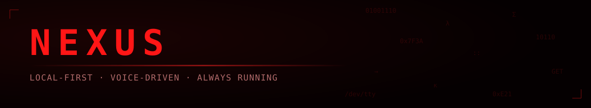

<div align="center">



<sub>Portfolio showcase — public documentation of a private project.<br/>Credentials and personal data are intentionally excluded.</sub>

<br/><br/>


-ff1616?style=for-the-badge&labelColor=050001)


</div>

---

NEXUS is my personal AI assistant on Linux (Fedora / KDE Plasma). Since v2 it is **not a standalone app**: it is the personal layer that lives inside **[Phantom](https://github.com/Julian-Rincon/phantom)**, my multi-agent workbench (a fork of Codeg that runs Claude Code, OpenCode and Hermes side by side).

**TL;DR:** Phantom provides the UI, the agents, the models, permissions, scheduling, voice and a desktop "island". NEXUS provides what Phantom doesn't have: knowledge of my day (calendar, mail, tasks, services), initiative (a guaranteed daily briefing), and an identity of its own, including its own voice. It's exposed to every agent through one MCP server.

---

## Why v2 exists

The first NEXUS was a 47k-line Python monolith. I built every layer myself: a router across five LLM providers, an always-listening wake word, a Qt HUD, a sudo-powered gaming mode, auto-start and a self-healing loop every 30 seconds.

**It never became reliable enough to depend on.** Free and academic LLM endpoints kept expiring, so the router needed constant care. The always-on microphone was fragile. Above all, it fought the operating system: it wrote kernel settings, rewrote its own autostart and ran root helpers. When it misbehaved, it was hard to even turn off.

v2 is the lesson applied. **Compose instead of rebuild:**

| Concern | v1 (own implementation) | v2 |
|---|---|---|
| Choosing a model | 5-tier router with circuit breakers | Phantom's **measured scorecard** (error rates from my own history, Wilson 95% bound) |
| Agents & UI | Custom HUD + Telegram bot | Phantom: app, desktop island, Telegram channel |
| Scheduling | In-process timers | Phantom automations (cron) + `systemd --user` timers |
| Voice | Always-on wake word | Push-to-talk in Phantom, a distinct voice per agent |
| System tuning | sudo helpers, sysctl, ACPI profiles | None — GameMode/PowerDevil already do it natively |
| Size | ~47,000 lines | ~700 lines + tests |

The v1 code is preserved in the private repo's history (tag `v1-final`). Its docs are archived in [`docs/v1/`](docs/v1/).

---

## Architecture

```
 Telegram ─┐
 Island  ──┼──▶ PHANTOM  (local server, 127.0.0.1)
 App     ──┤      agents: Claude Code · OpenCode · Hermes
 Voice   ──┘      automations · worktrees · permissions · model scorecard
                          │  MCP (stdio)
                          ▼
                 nexus-mcp — personal tools, no LLM of its own
                 ├─ nexus_agenda     Google Calendar API (all visible calendars)
                 ├─ nexus_mail       Gmail API, headers only — never message bodies
                 ├─ nexus_tasks      personal task store
                 ├─ nexus_pipeline   health of my internship-pipeline service
                 ├─ nexus_notify     Telegram + native Plasma notification
                 └─ nexus_route      best agent/model for a task category
```

- **NEXUS has its own space in Phantom.** That's a folder whose `CLAUDE.md`/`AGENTS.md` define the persona. Any agent opened there *is* NEXUS, and my Telegram chat lands there by default.
- **Every agent gets the same tools.** Claude Code, OpenCode and Hermes all have `nexus-mcp` registered.

---

## What it does today

- **Daily briefing at 8:30.** A Phantom automation asks the best-measured model to read my day and send a short brief with schedule, three priorities and alerts, to Telegram and the desktop.
- **Delivery guarantee.** Two native `systemd --user` timers back it up:
  - **8:20:** re-picks the model from live measurements.
  - **8:45:** if no briefing succeeded today, re-runs it on a different agent.
  - The check timer is `Persistent`, so if the laptop was off it runs at boot.
  - This exists because on launch day the free tier of the default model ran out of quota mid-morning.
- **Talk to it anywhere.** From the Phantom app, the desktop island, or Telegram. In Telegram, `/menu` lists recent conversations as buttons, so I can jump into any agent session and back.
- **A voice per agent.** NEXUS speaks with its own cloned voice, generated locally with Chatterbox on the GPU. The other agents use distinct local voices.
  - Technical English inside Spanish sentences (pipeline, deploy, API) is normalized so it's pronounced correctly.
  - If the GPU voice service is down, speech falls back to a CPU voice instead of going silent.
- **Native identity on the desktop.** Notifications arrive as "NEXUS" with an icon, and can be configured in Plasma's own settings like any app.

---

## Engineering decisions worth noting

- **Model choice is data, not opinion.** The scorecard ranks agent/model pairs per task category using my own usage history. While wiring NEXUS to it, I found and fixed a bug in Phantom: it recommended the short model id from history, while the agent only accepted the catalog's full id, so the recommendation was silently ignored.
- **Read-only by construction.** The Google token could write, but NEXUS only issues GET requests, and from Gmail it requests metadata only.
- **Tests never touch the live machine.** Every fake raises on any call it didn't expect: real HTTP, Telegram, notifications or IMAP fail the test instead of silently running. That rule comes from v1, where a test that didn't fail opened real browser tabs.
- **Nothing invasive.** No sudo, no `/sys`, no self-installed autostart, no polling loops. Removing it means deleting user units.
- **Human-gated where it matters.** Agents implement, a reviewer verifies before anything is merged, and restarts that would interrupt live work are run by me, not by the assistant.

---

## Roadmap

| Phase | Status |
|---|---|
| Retire v1 (services, root helpers, remote power channel) | Done |
| `nexus-mcp` + guaranteed daily briefing | Done |
| Voice per agent · Telegram `/menu` | Done (in Phantom) |
| Push-to-talk with a global shortcut | Next |
| Project copilot: watch my repos, fix in an isolated worktree, reviewed before merging | Planned |
| Shared memory across agents | Planned |
| Phone access over Tailscale + a deterministic always-on cloud watchdog | Planned |

---

## For employers and reviewers

This project shows:

- **Systems thinking over feature count.** I rebuilt a 47k-line system as ~700 lines on top of existing tools, and I can explain exactly what v1 taught me.
- **LLM engineering grounded in measurement.** Model routing comes from a measured scorecard, with a fallback strategy for provider quotas.
- **Linux integration done natively.** MCP, `systemd --user` timers, desktop entries and Plasma notifications, with no root.
- **Operational honesty.** Failures found in testing (quota exhaustion, a model-id mismatch, three bugs in the voice service) were root-caused and turned into guards and tests.

A live walkthrough of the private implementation is available on request.

<sub>v1 HUD, retired: <a href="assets/v1_hud.png">screenshot</a></sub>
