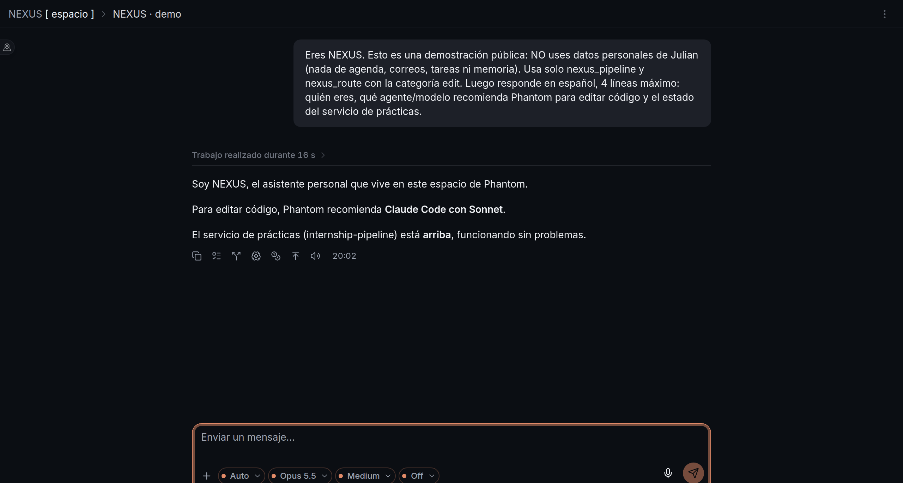
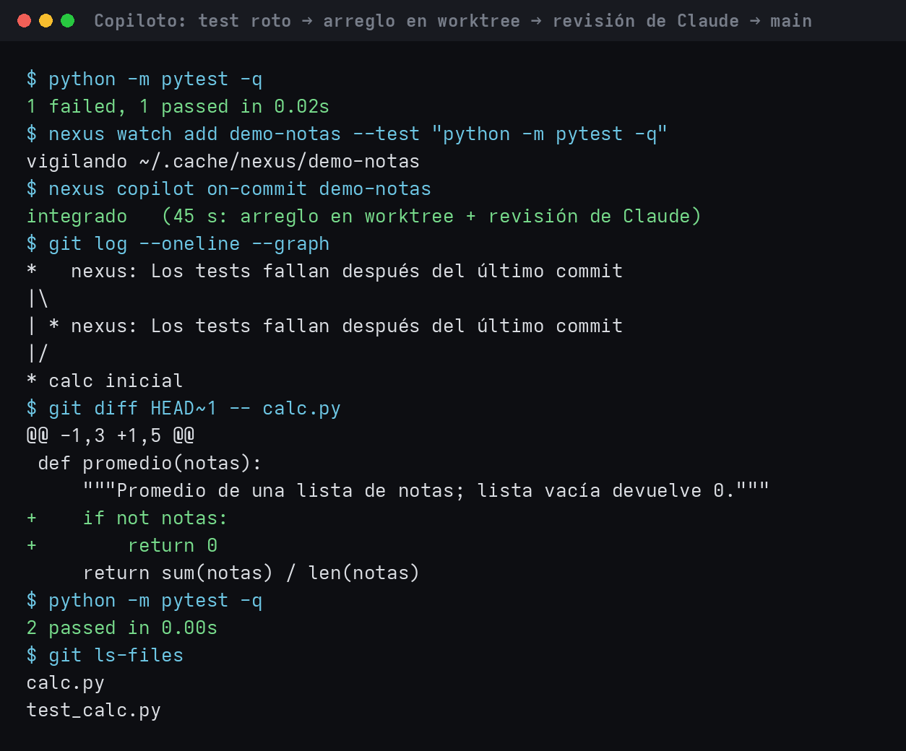
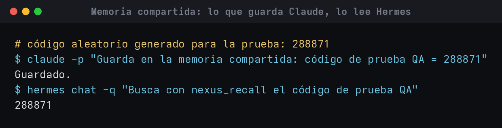
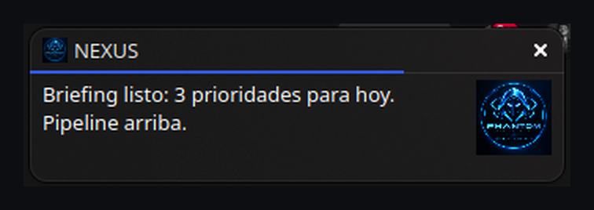
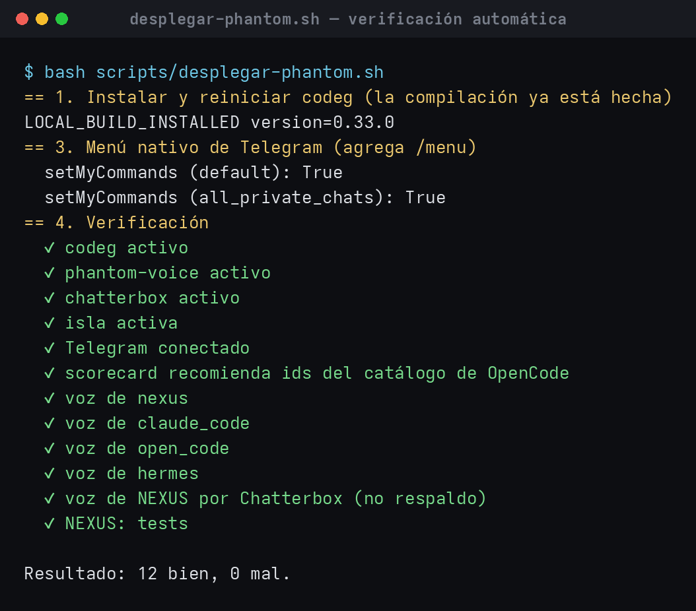
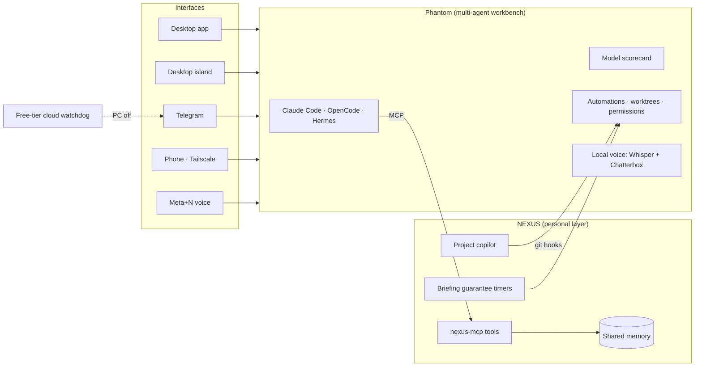

Public showcase of a private project. Source code, credentials and personal data are intentionally excluded. Every screenshot and terminal capture below comes from the running system.

  

---

## In one paragraph

NEXUS is my personal AI assistant. It plans my day, talks with a voice of its own, remembers what matters across every AI agent I use, and watches all my code repositories so a broken test gets fixed, reviewed and merged without me asking. It is not a standalone app: it is a small personal layer (~1,900 lines of Python plus tests) on top of **[Phantom](https://github.com/Julian-Rincon/phantom)**, my multi-agent workbench that runs Claude Code, OpenCode and Hermes side by side. Phantom provides the agents, models, UI and voice. NEXUS provides context, memory and initiative.

 NEXUS answering in its own Phantom workspace: identity, a model chosen from measured data, and a live service check. The 🔊 icon reads any answer aloud in the agent's voice.

---

## What it does

| Capability | How it works |
|---|---|
| **Daily briefing** | Every morning a Phantom automation reads my calendar, inbox, tasks and services and sends three priorities to Telegram and the desktop. Two `systemd` timers guarantee delivery: if the run fails (for example, a free model runs out of quota), it is re-run on another agent. |
| **Talk to it** | A global shortcut (Meta+N) records, transcribes locally (Whisper on the GPU) and answers out loud. Pressing it again stops the answer, so two replies never overlap. Voice also works in the app on the phone and through Telegram voice notes. |
| **A voice per agent** | NEXUS speaks with its own voice, generated locally with Chatterbox. The other agents each have a distinct voice. English technical terms inside Spanish sentences are pronounced correctly. |
| **Shared memory** | One memory store (SQLite with full-text search) exposed over MCP, so Claude, OpenCode and Hermes all read and write the same facts. |
| **Project copilot** | Watches **every** repository I have, including new ones, automatically. When a commit breaks the tests, an agent fixes it in an isolated git worktree, Claude reviews the diff and re-runs the tests, and only then is it merged. |
| **Model routing by evidence** | NEXUS never hard-codes a provider. It asks Phantom's scorecard, which ranks agent/model pairs by their measured error rates on my own history. |
| **Always-on watchdog** | A dependency-free Python service on a free-tier cloud VM. It alerts me when a service goes down, and when my PC is off it sends the briefing and answers basic Telegram commands. |
| **Phone access** | Phantom (chat, voice and agents) is reachable from my phone over a private Tailscale network with HTTPS. Nothing is exposed to the public internet. |

---

## Evidence

### The copilot fixing a real failing test

A repository with a broken function. One commit later, an agent fixed it in a separate worktree, Claude reviewed and approved it, the tests went green and the fix landed on `main`. That took 45 seconds, and no build artifacts were committed.

### Memory shared across different agents

To prove the agents really share memory (and that one isn't just guessing), a random number is generated. One agent (Claude Code) stores it, and a different agent (Hermes, a different model from a different provider) retrieves it.

### Native to the desktop

NEXUS notifications show up as a first-class app in KDE Plasma, so they can be silenced or configured like any other app. The "island" at the top of the screen shows which agents are working right now.

&nbsp;&nbsp;

### Every deploy verifies itself

The deploy script installs, restarts and then checks twelve things on its own: services, Telegram, model routing, all four voices (including that NEXUS uses its own voice and not the fallback) and the test suite.

---

## Architecture

```mermaid
flowchart LR
    subgraph Interfaces
        A[Desktop app]
        B[Desktop island]
        C[Telegram]
        D[Phone · Tailscale]
        E[Meta+N voice]
    end
    subgraph Phantom["Phantom (multi-agent workbench)"]
        F[Claude Code · OpenCode · Hermes]
        G[Model scorecard]
        H[Automations · worktrees · permissions]
        I[Local voice: Whisper + Chatterbox]
    end
    subgraph NEXUS["NEXUS (personal layer)"]
        J[nexus-mcp tools]
        K[(Shared memory)]
        L[Project copilot]
        M[Briefing guarantee timers]
    end
    N[Free-tier cloud watchdog]
    A & B & C & D & E --> Phantom
    F -- MCP --> J
    J --> K
    L -- git hooks --> H
    M --> H
    N -. PC off .-> C
```

**Design principles**
- **Compose, don't rebuild.** Agents, UI, scheduling and voice already exist in Phantom; NEXUS only adds what is personal.
- **Nothing invasive.** No root, no kernel tweaks, no self-installed autostart. On the desktop everything is event-driven (git hooks, path watchers, timers) instead of polling; every piece is a user-level service that is removed by deleting it.
- **Read-only where it can be.** Calendar and mail are read-only, and from mail NEXUS reads headers only, never message bodies.
- **Human-gated where it matters.** The copilot never pushes and never force-merges. If I have unsaved changes in the same files, or a merge conflicts, it stops and tells me.
- **Tests never touch the real machine.** Every fake raises on any call it did not expect, so a test can't silently send a real message or open a real browser.

---

## Why v2 exists

The first NEXUS was a 47,000-line monolith that rebuilt everything itself: a router across five LLM providers, an always-listening wake word, a desktop HUD and a gaming mode that tuned the kernel with root helpers. It taught me a lot, but it was never reliable enough to depend on: free model endpoints kept expiring, the always-on microphone was fragile, and it fought the operating system instead of working with it.

v2 applies that lesson. The same goals now take a fraction of the code, run with no root access, and come with a test suite and self-verifying deploys. The v1 design is archived in [`docs/v1/`](docs/v1/).

| | v1 | v2 |
|---|---|---|
| Size | ~47,000 lines | ~1,900 lines + 110 tests |
| Model choice | Hand-written 5-provider router | Measured scorecard |
| Voice | Always-on wake word | Push-to-talk, voice per agent |
| System tuning | Root helpers, kernel settings | None (native desktop tools) |
| Reach | Desktop + one bot | Desktop, phone, Telegram, cloud watchdog |

---

## What this project demonstrates

- **Systems design with restraint.** Replacing a large custom system with a small layer on top of solid tools, and being able to explain what the first version taught me.
- **LLM engineering grounded in measurement.** Routing by measured error rates, fallbacks for provider quotas, and verification instead of trusting what an agent reports.
- **Native Linux integration.** MCP, `systemd` user units and path watchers, KDE global shortcuts over D-Bus, desktop entries and Plasma notifications.
- **Operational discipline.** Real failures found while building were root-caused and turned into tests and guards: a free tier running out of quota, a model-id mismatch, overlapping voices, build artifacts in commits.

A live walkthrough of the private implementation is available on request.

Retired v1 interface: <a href="assets/v1_hud.png">screenshot</a> · Not licensed for reuse; see <a href="NOTICE.md">NOTICE</a>.
